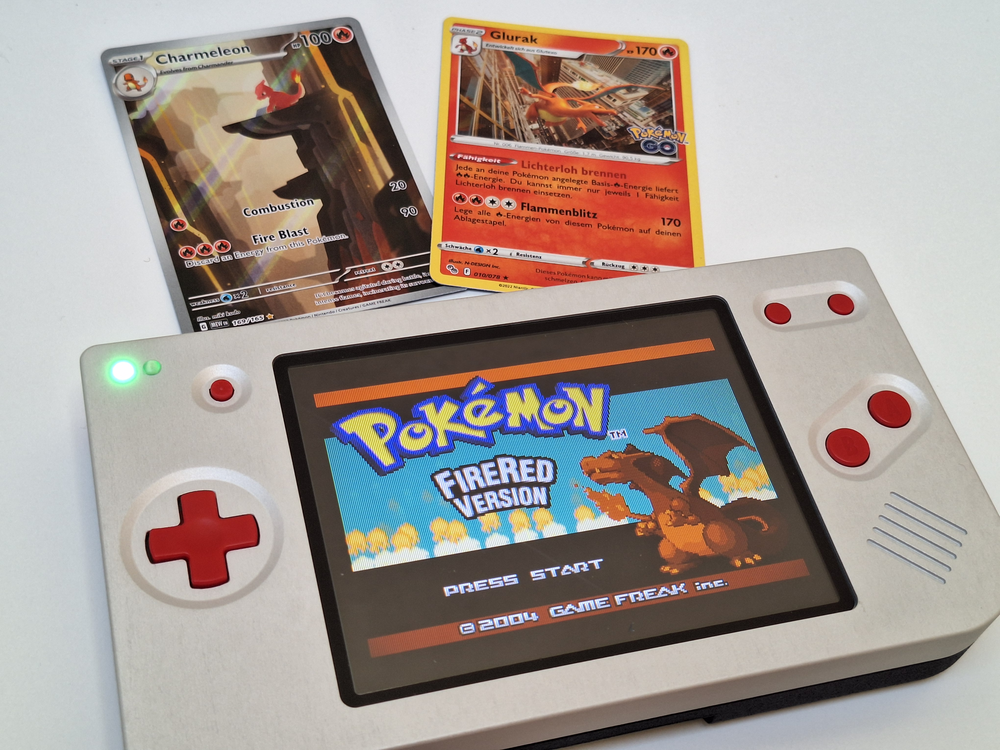
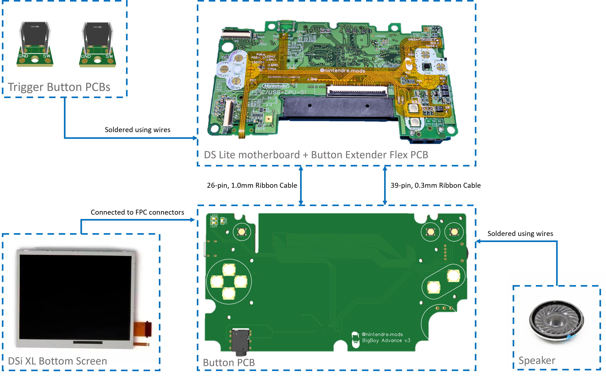
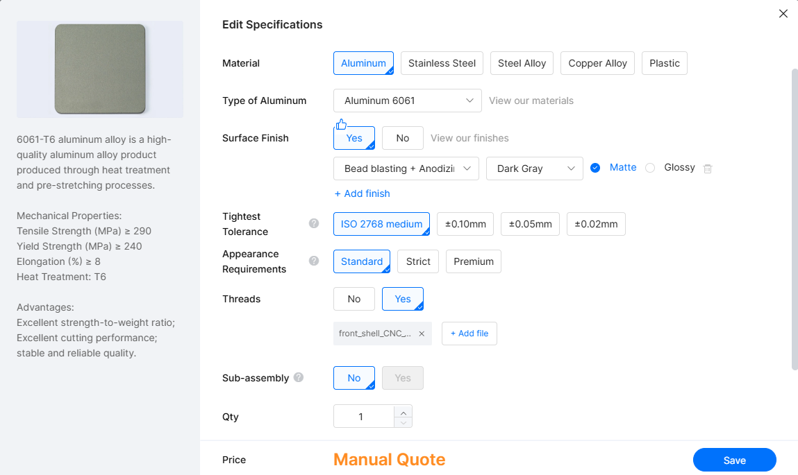
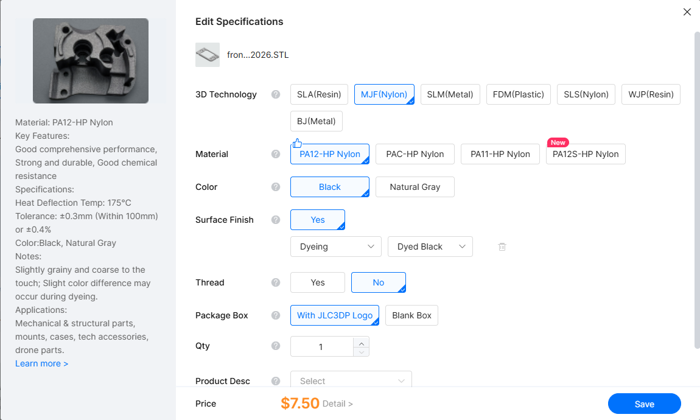
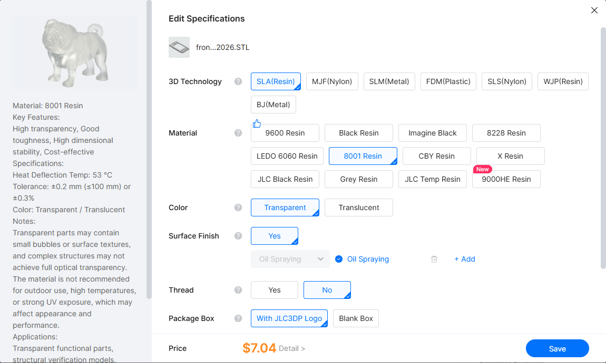

# BigBoy-Advance
The BigBoy Advance is a variation of a Game Boy Macro, that uses the larger screen of a Nintendo DSi XL and is housed in a custom designed shell. The GBA cartridge is inserted from the top of the console (like the original GBA) and is hidden. The console uses tactile buttons like the GBA SP. Together, these features provide the ultimate native GBA playing experience.

## Features
- Nintendo DSi XL display (~30% larger than DS Lite display)
- Game Boy Advance SP-style tactile buttons
- Top-mounted GBA cartridge
- SLA, SLS/MJF and CNC aluminium shell options
- USB-C charging port
## Buy the Kit
The BigBoy Advance electronics kit is available from my Etsy store.

[Buy the BigBoy Advance Kit on Etsy](https://www.etsy.com/listing/4590307147/bigboy-advance-kit-nintendo-ds-lite-with)

## System Overview
A visual representation of the mod’s electronic architecture can be seen in the figure below.

The BigBoy Advance consists of three custom PCBs. They are:
-	Button PCB
-	Button Extender Flex PCB
-	Trigger Button PCB (x2)

The button extender flex PCB is soldered directly to various pads on the Nintendo DS Lite motherboard and sits flush on the motherboard. It serves as the “translator” between the button PCB and the motherboard. Its purpose is to connect various signals, including audio, buttons, status LEDs and volume levels, between the motherboard and button PCB.

The button PCB repositions components such as the buttons, volume wheel, status LED and charge port to fit into the newly designed shell for the larger screen. It contains circuitry to reroute the DS Lite lower screen signals to be compatible with the DSi XL lower screen. The lower screen FPC connector on the motherboard is connected to the button PCB via a 39-pin ribbon cable. The signal is then rerouted to the corresponding pins of a 37-pin and 4-pin FPC connector that are compatible with the Nintendo DSi XL lower screen ribbon cable configuration.

The trigger buttons PCBs are used to mount right angle tactile buttons in the correct position in the shell so that they can be actuated by the trigger buttons. These PCBs contain solder pads and are connected to the motherboard using soldered wires.

## Installation

Detailed assembly instructions, including the complete bill of materials and
required tools, are available here:

**[BigBoy Advance Installation Instructions (PDF)](Documentation/BigBoy_Advance_Installation_Instructions.pdf)**

## Shell Production

Currently, it is possible to use various manufacturing methods for the shell
parts. The front shell has different versions for CNC manufacturing, SLS/MJF
(nylon) printing or SLA (resin) printing. The rear shell and battery cover are
compatible with SLS/MJF and SLA printing. There is no CNC version for these
parts yet.

The production files for the different manufacturing methods can be found
**[here](Production/Shell/)**. I have included the STL and STEP files for all parts, so
that modders with the right skillset can make changes if they want.

> **NOTE:** If changes are made, I cannot guarantee that the parts will still work.

The parts can be ordered from any 3D printing or CNC manufacturing provider.
I usually order from JLC3DP and JLCCNC. Below I provide the settings I select
when ordering for the different manufacturing methods.

### Aluminium CNC Machining

After uploading the STEP file to JLCCNC, click the option “Edit Specifications”. Surface finish is up to your own preference, and the cost may vary depending on your selection. The two important selections are:
-	**Tightest Tolerance:** ISO2768 medium. This ISO tolerance class is tight enough for this design. No tighter tolerances are necessary.
-	**Threads:** Select “Yes”, indicating that the part requires tapped threads. You will be asked to upload a technical drawing, which can be downloaded [here](Production/Shell/CNC/BBA_front_shell_drawing.PDF).

### SLS/MJF (Nylon) Printing

SLS and MJF are different printing technologies, both capable of producing parts in PA12 (nylon). I prefer MJF over SLS due to slightly better surface finish and tolerances. After uploading the STL file to JLC3DP, click the option “Edit Specifications”. The important options are:
-	**3D Technology:** Select MJF (Nylon)
-	**Material:** Select PA12-HP Nylon. Unfortunately, this material is only available in black and grey. If you want a different colour, select PAC-HP Nylon, which supports full-colour MJF printing. I have not tested this option. For colour printing, JLC3DP requires the model to be uploaded as a 3MF file containing the colour data. If the 3MF file does not contain colour information, the part will be printed in grey by default. You will need to create the 3MF file yourself from the provided STEP file and assign the desired colour before uploading it to JLC3DP.
-	**Thread:** Select “No”. Heat-set inserts will be used to add threads for machine screws to the part.

### SLA (Resin) Printing

Resin printing is a very popular option for custom Gameboy shells, particularly because transparent resins allow the internal PCBs to remain visible (nerds love to see PCBs). Although resin is a favourite among modders, I dislike it due to it being extremely brittle, often cracking when screws are inserted or during transport.

I have designed a version of the shell parts specifically for resin printing. This version uses self-tapping screws instead of the heat-set inserts used in the MJF/SLS version. Since resin is not a thermoplastic, heat-set inserts will not work. 

If you simply don’t like using heat-set inserts, you can also print the resin version using MJF/SLS and use self-tapping screws instead. 

After uploading the STL file to JLC3DP, click the option “Edit Specifications”. The important options are:
-	**3D Technology:** Select SLA (Resin)
-	**Material:** Select 8001 Resin. I am assuming you want a transparent shell, otherwise select any other material of your choice.
-	**Color:** Select Transparent (assuming you selected 8001 Resin). 
-	**Thread:** Select "No".

## Future Work

I initially set out to develop the best console for myself to play GBA games on, since it is my favourite era of Nintendo console. It is the era I grew up in and the games I am most nostalgic about. In my opinion, I have achieved that goal and I am happy with the results.

Since the heart of this console is a Nintendo DS Lite, there are always people who don't see the point of "removing functionality" from a perfectly good console by taking away one of its screens. To appease these people, and because I have an interesting idea for the implementation, I plan to create a new version of this project in the future.

It will be called the BigBoy Advance TOAST (**T**V **O**ut **A**nd **S**creen Switch with **T**ouchscreen). This version will retain the touchscreen functionality of the original Nintendo DS Lite and also incorporate the screen switching and TV-out mod discovered by the folks at Lost Nintendo History (LNH), with my own twist on the functionality.

I have already built the first prototype of this version and with a few modifications, it will be available in the near future.

## License

The BigBoy Advance design files and documentation in this repository are
licensed under the [Creative Commons Attribution-NonCommercial 4.0 International
(CC BY-NC 4.0)](https://creativecommons.org/licenses/by-nc/4.0/) license.

You are free to build, modify and share the BigBoy Advance design for
non-commercial purposes, provided appropriate credit is given.

Commercial use, including the sale of products manufactured from these design
files, is not permitted without prior permission.

If you are interested in commercial use of the BigBoy Advance design, please
contact me for permission.

## Disclaimer

BigBoy Advance is an independent modification project and is not affiliated
with, authorized by, sponsored by, or endorsed by Nintendo. Nintendo DS,
Nintendo DSi, Game Boy Advance and related names are trademarks of their
respective owners.

Modifying a Nintendo DS Lite requires soldering and permanent modification of
the original hardware. Perform the modification at your own risk.
